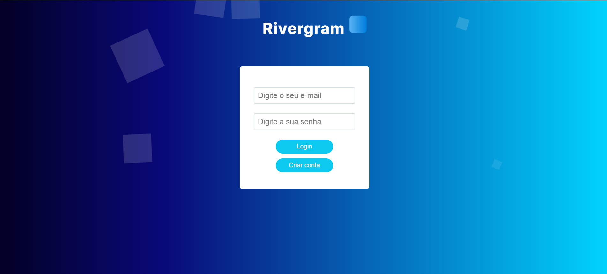

<h1 align="center"> RIVERGRAM </h1>

  <a href="#-projeto">Projeto</a>&nbsp;&nbsp;&nbsp;|&nbsp;&nbsp;
  <a href="#-tecnologias">Tecnologias</a>&nbsp;&nbsp;&nbsp;|&nbsp;&nbsp;&nbsp;
  <a href="#-contato">Contato</a>&nbsp;&nbsp;&nbsp;&nbsp;&nbsp;&nbsp;

 

  

 

## 💻 Projeto

O projeto é uma rede social desenvolvida durante o programa de treinamento YOUTHEFUTURE da [Riversoft](https://www.riversoft.com.br/).

  

## 🚀 Tecnologias

Esse projeto foi desenvolvido com as seguintes tecnologias:

&nbsp;
&nbsp;
&nbsp;
&nbsp;
&nbsp;
&nbsp;
&nbsp;
&nbsp;
&nbsp;
&nbsp;

 

 

## ⚡ Contato

